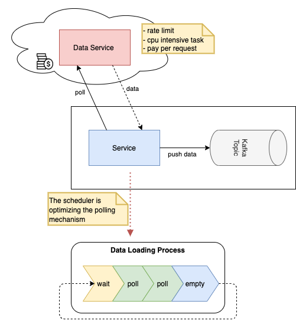

# CronScheduler
Basic cron scheduler which can be used in different cases.

## Purpose
Kafka connect usually works by using streams or when it's not possible, it tries to poll at a very short interval.

In some cases we would like to not start the replication right away and have a little space between each runs. Either because the
process is CPU intensive, the other system has a rate limit, or we're paying per request to the other system.

This library helps us to solve these problems.

### Diagram


## Cron expression
Take care, all expressions must be declared as [Quartz expressions](http://www.quartz-scheduler.org/documentation/). 

The following example expression allows an execution every five minutes.

```bash
0 0/5 * * * ?
```

## Implementation
This is a very basic implementation example.

```java
// Create scheduler
final CronScheduler scheduler = new CronScheduler("0 0/5 * * * ?");

// will be executed very often
public List<Object> poll() {
    if(scheduler.checkIfExecutionIsAllowed()) {
        final List<Object> data = getData();
        
        if(data.isEmpty()) {
            scheduler.moveToNextTimeSlot();
            return emptyList();
        }

        return data;
    }

    scheduler.waitUntilNextExecutionIsAllowed();
    return emptyList();
}

public void stop() {
    scheduler.stop();
}
```


## Development and testing

To build and test this lib run:

```bash
mvn clean verify
```

